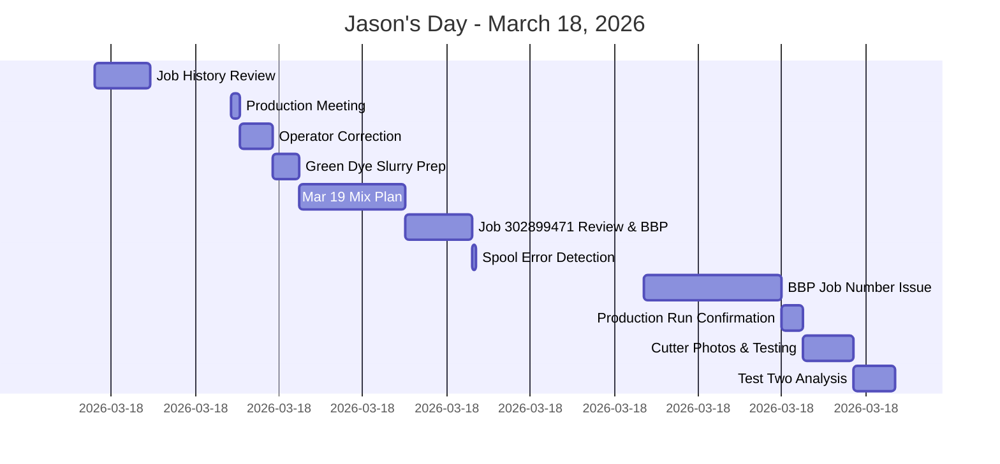

# March 18, 2026 - Daily Summary

## Timeline Overview

## Key Accomplishments ✅

**Material & Process Management:**
- Prepped 4L green dye slurry (16 g PG7 + 160 mL NMP) for overnight soaking
- Finalized Mar 19 mixing sequence (15 min dispersion → 30 min with heated PAA → letdown with 3.5L PAA + slide check)
- Locked in mixing plan before start of tomorrow's work

**Production Quality:**
- Caught wrong spool tied on 0.055" job before run started (critical error prevention)
- Corrected operator logged into wrong job assignment
- Verified incident timeline export (all 29 entries confirmed, no omissions) and sent to HR

**Technical Achievement:**
- Confirmed successful run of "13 die jam + 3 spaced" strategy on job 302906970 (66.67% concentricity requirement)
- Completed second 3" vs 6" de core stretch test on Hangzhou job (0.0606" ID, 0.006" wall)
- Built initial BBP recommendation for job 302899471 based on historical analysis

**Documentation & Research:**
- Identified job 0594 as similar to job 055 for future reference
- Reviewed last 5 runs and selected run 302580610 as strongest reference
- Took comparison photos of operator cuts vs modified finished good cutter
- Captured operator baseline for hand cutting (2-4 pieces per blade, both ends)

## Active Risks & Blockers ⚠️

**High Priority:**
- **Job 302899471 Setup Risk**: Pass count discussion between 22-24 passes; braid condition needs verification
- **Paperwork Mismatch**: Two BBPs share same job number after machine 24→23 transfer; reissue needed
- **High-Risk Tolerance**: Job 302906970 has 66.67% minimum concentricity (tight for Dev 3 job)
- **Unknown Defect**: Spots seen on input wire and in ovens; root cause still unknown

**Medium Priority:**
- Test Two data entry needed before full interpretation blocked
- Chemical burn incident on floor needs follow-up reporting verification
- Roll cutter blade life comparison still in progress

## Decisions Made 🎯

1. **Dye Selection**: Used 16g with 160mL NMP for full 4L green batch; overnight soak approved
2. **Mix Sequence**: 15→30→20-30 min steps with PAA heating at ~100°F and slide check required
3. **Dye Type**: Abbott Black chosen over carbon option for 0.055" job
4. **Reference Job**: Run 302580610 set as strongest historical reference for job 302899471
5. **Strategy Validation**: "13 die jam + 3 spaced" pattern confirmed as repeatable setup for tight concentricity

## Tomorrow's Critical Path 📅

**Grace's On-Site Visit (March 19)**
- Quality checks and all paperwork must be ready
- Green slurry mix sequence must be followed exactly (15→30→letdown)
- First thing tomorrow morning is slurry mixing continuation
- Job 302906970 must be flagged upward with full specs: 0.055 ± 0.0005" ID, 0.0015 ± 0.0003" wall, 66.67% minimum concentricity

**Pending Actions:**
- [ ] Run Mar 19 slurry mixing steps and slide check before line run
- [ ] Lock final BBP and pass count for job 302899471 with Dustin
- [ ] Fix BBP job number mismatch and reissue correct paperwork
- [ ] Notify Wayne of job 302906970 OPN 312239 specifications
- [ ] Obtain Keyence validation on cutter comparison photos
- [ ] Enter Test Two de core stretch data and complete analysis
- [ ] Compare roll cutter blade life against 2-4 pieces/blade baseline

## Key Insights & Ideas 💡

- **Repeatability**: The "13 die jam + 3 spaced" pattern is becoming a formal reference for very tight concentricity jobs
- **Process Control**: Forced paperwork check after machine moves can prevent traceability breaks
- **Testing Sensitivity**: 3" vs 6" stretch results are sensitive to job geometry; need side-by-side Test One/Two comparison before broad conclusions
- **Equipment Evolution**: Finished good cutter project now has photos + baseline; next step is side-by-side time study including blade changes

---
**Date**: March 18, 2026 | **Time Span**: 06:48 - 15:51 | **Status**: High productivity day with critical error prevention and successful experimental validation