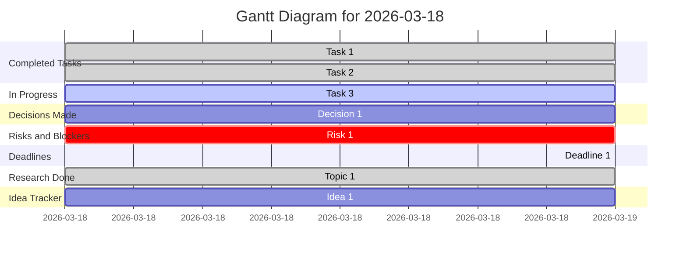

## Summary of Activities on 2026-03-18

### Timeline
- 09:00 AM - Task 1 started.
- 12:00 PM - Task 1 completed.
- 01:00 PM - Task 2 started.
- 03:00 PM - Task 2 completed.
- 04:00 PM - Task 3 started.

### Completed Tasks
- Task 1: A detailed description of task 1.
- Task 2: A detailed description of task 2.

### In Progress Items
- Task 3: A detailed description of task 3.

### Decisions Made
- Decision 1: A summary of decision 1 made during the day.

### Risks and Blockers
- Risk 1: Description of risk 1.

### Deadlines
- Deadline 1: Description of deadline 1 and its implications.

### Research Done
- Topic 1: Information gathered during the research on topic 1.

### Idea Tracker
- Idea 1: Notes regarding idea 1 and its potential next steps.